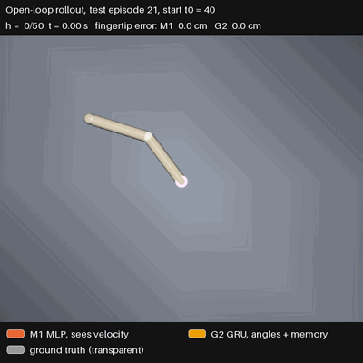
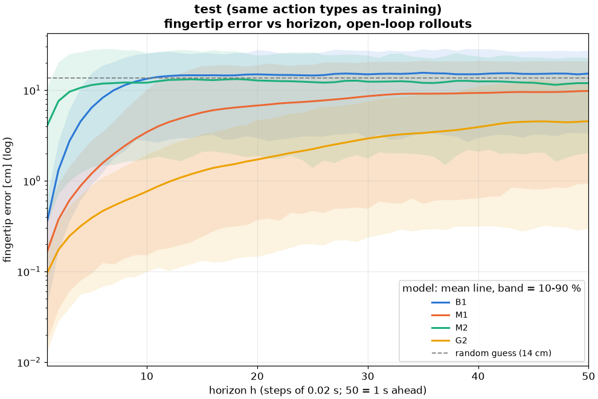

# Reacher dynamics: learning the physics of a robot arm

Learn a forward model **f(sₜ, aₜ) → sₜ₊₁** for the MuJoCo Reacher, a 2-joint arm, then test it the way a planner
would use it: give the model the true starting state and 50 future torques, and let it predict open loop on its own
output for 50 steps (1 s). A second question: what happens when the joint velocities are hidden, and can a
recurrent network recover them from memory?



*A typical test rollout (its errors are close to the test averages). Orange-red = M1, yellow = G2, transparent white
= ground truth. MP4: [`media/rollout_m1_g2_test_ep21_t40.mp4`](media/rollout_m1_g2_test_ep21_t40.mp4).*

---

## Contents
1. [The arm](#the-arm)
2. [Dataset: how it was made](#dataset-how-it-was-made)
3. [The 4 models](#the-4-models)
4. [Training](#training)
5. [Evaluation](#evaluation)
6. [Results](#results)
7. [What we learned](#what-we-learned)
8. [Commands](#commands)
9. [Files](#files)

---

## The arm

| | |
|---|---|
| Environment | Gymnasium `Reacher-v5` (MuJoCo) |
| State | joint angles q = (q₁ shoulder, q₂ elbow) in rad, velocities q̇ in rad/s |
| Action | torques a = (a₁, a₂) in [−1, 1] (gear 200) |
| Time step | dt = 0.02 s (2 MuJoCo steps of 0.01 s) |
| Links | 10 cm + 11 cm → the fingertip reaches 21 cm from the base |
| Joint limits | shoulder: none (full turns); elbow: ±3 rad, and the light elbow hits this stop often |

The fingertip position comes from the angles (forward kinematics):
x = 0.10·cos q₁ + 0.11·cos(q₁+q₂), y = 0.10·sin q₁ + 0.11·sin(q₁+q₂).

## Dataset: how it was made

Code: [`physai/datasets/reacher_dynamics.py`](../../physai/datasets/reacher_dynamics.py) →
`data/reacher_dynamics_v1.npz` (2.1 MB, not in git; recreate it with the command below).

**Episodes.** 1,000 episodes of 100 steps. Each starts from a random pose (shoulder anywhere on the circle, elbow within
±3 rad) and a random velocity (up to 20 rad/s shoulder, 10 rad/s elbow). One episode stores 101 states and 100 actions.

**Actions: a mix of torque patterns.** A learned model only knows the motions it has seen, so the action sequences
decide what the model can learn. Plain i.i.d. random torques mostly cancel out and the arm barely moves. Instead, each
training episode is cut into 1–3 segments, and each segment uses one of 4 generators:

| Generator | What it does |
|---|---|
| Ornstein-Uhlenbeck | smooth random drift (correlated noise) |
| Sticky | a random torque held for 5–15 steps, then a new one |
| Bang-bang | full torque ±1, switching side every 5–20 steps |
| Sine | sine waves of 0.2–2 Hz |

These correlated actions reach about **4× the speed range** of i.i.d. actions (99% of shoulder speeds within
120 rad/s vs 29 rad/s) and drive the elbow into its limit often (41% of training states have the elbow pinned there).

**Splits.** By episode, never by step, so no test step shares an episode with a training step:

| Split | Episodes | Actions | Used for |
|---|---|---|---|
| train | 800 | mixed | fitting the weights, normalisation statistics |
| val | 100 | mixed | early stopping, choosing the best epoch |
| test | 100 | mixed | final results |
| ood | 100 | **chirp**: a sine sweeping 0.1 → 4 Hz | an action pattern never seen in training |

Coverage plots, train vs i.i.d. vs chirp: [`figures/coverage_hist.png`](figures/coverage_hist.png),
[`figures/coverage_space.png`](figures/coverage_space.png).

**Two views of the same data** ([`physai/datasets/reacher_dynamics_torch.py`](../../physai/datasets/reacher_dynamics_torch.py)):

| View | Input x per step | Target y per step | Markov? |
|---|---|---|---|
| `obs=full` | [sin q, cos q, q̇, a] (8) | [Δq, Δq̇] (4) | yes: x holds the whole state |
| `obs=angles` | [sin q, cos q, a] (6) | [Δq] (2) | no: the velocity is hidden |

Design choices:
- **Predict the change Δ, not the next state.** Δq ≈ q̇·dt, so the model only learns a small correction.
- **sin/cos of the angle** as input, so 0 and 2π look the same to the model.
- **Δq is the raw difference, never wrapped.** The fast shoulder can move more than π in one step (up to 3.4 rad);
  wrapping would flip those steps. Angles are only wrapped when errors are measured.
- **Inputs and targets are z-scored** with train-split statistics. The models store these in buffers, so every
  checkpoint carries its own normalisation.

## The 4 models

Code: [`physai/models/dynamics.py`](../../physai/models/dynamics.py). All share one interface: `step`, `warmup`,
`rollout`, in raw units.

| Model | Sees | Architecture | Parameters |
|---|---|---|---|
| **B1** baseline | q, q̇ | constant velocity: q' = q + q̇·dt, q̇' = q̇ (no learning, ignores torque) | 0 |
| **M1** | q, q̇, a | MLP 8 → 256 → 256 → 256 → 4, SiLU | 134,916 |
| **M2** | q, a | the same MLP, 6 → … → 2 (velocity hidden, no memory) | 133,890 |
| **G2** | q, a | GRU with 256 hidden units + linear head 256 → 2 (velocity hidden, memory) | 203,266 |

M2 is the control experiment: it gets exactly the same inputs as G2 but no memory, so the difference between the two
shows what memory is worth.

## Training

Code: [`train.py`](train.py) with Hydra configs in [`configs/`](configs/). The configs combine a `model` (`mlp` or `gru`)
with an `obs` view (`full` or `angles`).

| Setting | MLP (M1, M2) | GRU (G2) |
|---|---|---|
| Batch | 256 independent transitions | 32 whole episodes (teacher forcing) |
| Loss | MSE on normalised Δ targets | same; the first 10 steps of each episode are not scored (memory still empty) |
| Optimiser | Adam, lr 1e-3 | Adam, lr 1e-3, gradient clipping 1.0 |
| Stopping | early stopping, patience 20 epochs on val loss | same (max 600 epochs) |
| Best epoch | M1: 62, M2: 21 | 186 |

Logging goes to Weights & Biases (project `physai-reacher`). The best checkpoint is saved to
`outputs/<date>/<time>/best.pt` and copied to `checkpoints/<run_name>.pt`, e.g. `checkpoints/mlp_full_s0.pt`.
Training is deterministic for a fixed seed: two M1 runs gave identical weights.

## Evaluation

Code: [`eval_rollouts.py`](eval_rollouts.py), on the **test** and **ood** splits.

**One-step error.** For every step t ≥ 10, the model gets the true state and predicts t+1.

**Open-loop rollouts.** From 5 starts per episode (t₀ = 10, 20, 30, 40, 50 → 500 rollouts per split), the model gets
the true state at t₀ and the true actions, then feeds on its own predictions for 50 steps. Errors are measured at every
horizon h = 1…50:
- wrapped angle error per joint (rad)
- **fingertip distance** between predicted and true position (cm): the main metric

**G2's warm-up.** Before each rollout, G2 reads the true history of the episode from step 0 to t₀−1 to fill its memory.
In training, its memory was only ever empty at step 0. Starting it empty in the middle of fast motion (a 10-step window
before t₀) made its first prediction about 6× worse, so the full history is used. This is also how it would run on a
robot, where the network keeps updating its memory at every step.

A "random guess" line is included for scale: the distance between the true fingertip and the fingertip of another,
random rollout at the same horizon (≈ 14 cm on test).

## Results

**Fingertip error (cm)**, mean over 500 rollouts. h = steps ahead, 1 step = 0.02 s.

Test (same action types as training):

| Model | 1-step | h = 1 | h = 5 | h = 10 | h = 25 | h = 50 (1 s) |
|---|---|---|---|---|---|---|
| B1 | 0.33 | 0.37 | 6.39 | 13.3 | 14.5 | 15.2 |
| M1 | 0.17 | 0.17 | 1.20 | 3.44 | 7.52 | 9.78 |
| M2 | 4.57 | 4.10 | 11.4 | 12.1 | 12.2 | 11.9 |
| **G2** | **0.08** | **0.10** | **0.39** | **0.76** | **2.23** | **4.54** |

OOD (chirp actions, never seen in training):

| Model | 1-step | h = 1 | h = 5 | h = 10 | h = 25 | h = 50 (1 s) |
|---|---|---|---|---|---|---|
| B1 | 0.35 | 0.32 | 6.67 | 15.0 | 17.1 | 18.2 |
| M1 | 0.21 | 0.18 | 1.28 | 3.94 | 9.54 | 15.0 |
| M2 | 4.01 | 3.71 | 13.3 | 14.6 | 15.1 | 16.0 |
| **G2** | **0.09** | **0.09** | **0.34** | **0.70** | **2.48** | **7.26** |

**Mean angle error (rad), shoulder / elbow:**

| Model | test h = 10 | test h = 50 | ood h = 10 | ood h = 50 |
|---|---|---|---|---|
| M1 | 0.10 / 0.29 | 0.49 / 0.99 | 0.09 / 0.35 | 0.43 / 1.50 |
| G2 | 0.08 / 0.03 | 0.53 / 0.11 | 0.08 / 0.03 | 0.49 / 0.24 |

**Success criteria**

| Criterion | Result |
|---|---|
| M1 beats B1 at every horizon 1–50 | ✅ 50 / 50 on test and ood |
| G2 at least 2× better than M2 at h = 10 | ✅ 15.8× test, 21.1× ood |
| How close does memory (G2) get to seeing velocity (M1)? | G2 beats M1 at every horizon |

**Figures**

| | test | ood (chirp) |
|---|---|---|
| Error vs horizon (mean + 10–90 % band) | [`rollout_error_vs_horizon_test.png`](figures/rollout_error_vs_horizon_test.png) | [`rollout_error_vs_horizon_ood.png`](figures/rollout_error_vs_horizon_ood.png) |
| Example rollouts vs ground truth (good / typical / bad for M1) | [`rollout_examples_test.png`](figures/rollout_examples_test.png) | [`rollout_examples_ood.png`](figures/rollout_examples_ood.png) |



**Videos** ([`media/`](media/)):

| File | Shows |
|---|---|
| [`rollout_m1_g2_test_ep21_t40.mp4`](media/rollout_m1_g2_test_ep21_t40.mp4) | typical rollout: M1 9.6 cm, G2 5.1 cm at 1 s |
| [`rollout_m1_g2_test_ep85_t50.mp4`](media/rollout_m1_g2_test_ep85_t50.mp4) | M1 failure case: the elbow runs through its limit (M1 21 cm, G2 3.2 cm) |
| [`g2_rollout_test_ep85_t50.mp4`](media/g2_rollout_test_ep85_t50.mp4) | G2 alone on the same rollout |

## What we learned

1. **One-step accuracy is misleading.** M1 is 1.7 mm off after one step and about 10 cm off after one second.
   Test models the way they will be used.
2. **Open-loop errors compound.** The model never sees the real arm again, so every error becomes the next input.
   Short horizons are accurate (G2 under 1 cm for 0.2 s); long ones drift. A controller needs fresh sensor data every
   so often, which is what model predictive control does: plan, apply one action, measure, re-plan.
3. **Memory can replace a missing state.** M2 and G2 get the same inputs: without memory the model is lost after one
   step; with memory it is the best model overall.
4. **Contacts break learned dynamics.** Most of M1's error comes from the elbow hitting its joint limit: the velocity
   drops to zero within one step, the MLP smooths that jump, and the wrong velocity is then carried for the rest of the
   rollout. G2 never predicts velocity, so the stop costs it little.
5. **Evaluate under the same conditions as training.** G2 looked 6× worse until its memory was warmed up the way it
   was trained.
6. **New action patterns hurt only at long horizons.** On the chirp set, short-horizon errors match the test set; at
   1 s, M1 rises from 9.8 to 15.0 cm and G2 from 4.5 to 7.3 cm.

## Commands

Run everything from the repo root. Set up the environment first (see the [main README](../../README.md#setup)).

```bash
# 1. Dataset: 1,000 mixed-action episodes + 100 chirp episodes, plus coverage plots
uv run python -m physai.datasets.reacher_dynamics            # add --wandb to log the coverage plots

# 2. Train (each run ends with checkpoints/<run_name>.pt)
uv run python projects/reacher_dynamics/train.py model=mlp obs=full      # M1 -> checkpoints/mlp_full_s0.pt
uv run python projects/reacher_dynamics/train.py model=mlp obs=angles    # M2 -> checkpoints/mlp_angles_s0.pt
uv run python projects/reacher_dynamics/train.py model=gru obs=angles    # G2 -> checkpoints/gru_angles_s0.pt

# Useful overrides
#   tracker=null    train without W&B
#   seed=1          another seed, saved as a separate checkpoint (mlp_full_s1.pt)
#   lr=3e-4  patience=10

# 3. Evaluate: one-step + rollout tables, success checks, figures in figures/
uv run python projects/reacher_dynamics/eval_rollouts.py                 # add --wandb to log tables, charts, figures

# 4. Render rollout videos (MP4) into media/
uv run python projects/reacher_dynamics/render_rollout.py                                 # M1 + G2, test ep 85, t0 = 50
uv run python projects/reacher_dynamics/render_rollout.py --episode 21 --start 40         # the typical rollout
uv run python projects/reacher_dynamics/render_rollout.py --models B1 M1 M2 G2            # all four arms
uv run python projects/reacher_dynamics/render_rollout.py --split ood --episode 44 --start 30
```

## Files

| Path | What it is |
|---|---|
| [`train.py`](train.py) | training script (Hydra + Accelerate + W&B, early stopping) |
| [`configs/train.yaml`](configs/train.yaml) | shared settings: seed, lr, patience, warm-up, W&B project |
| [`configs/model/`](configs/model/) | `mlp.yaml` (M1, M2), `gru.yaml` (G2) |
| [`configs/obs/`](configs/obs/) | `full.yaml` (with velocity), `angles.yaml` (velocity hidden) |
| [`eval_rollouts.py`](eval_rollouts.py) | one-step + open-loop rollout evaluation, figures, W&B logging |
| [`render_rollout.py`](render_rollout.py) | MuJoCo videos: model arms over a transparent ground-truth arm |
| [`figures/`](figures/) | coverage and evaluation plots |
| [`media/`](media/) | rollout videos (MP4) and the README GIF |
| [`physai/datasets/reacher_dynamics.py`](../../physai/datasets/reacher_dynamics.py) | simulator, action generators, data collection, coverage plots |
| [`physai/datasets/reacher_dynamics_torch.py`](../../physai/datasets/reacher_dynamics_torch.py) | the two data views, normalisation, PyTorch datasets |
| [`physai/models/dynamics.py`](../../physai/models/dynamics.py) | B1, M1, M2, G2 and checkpoint loading |
