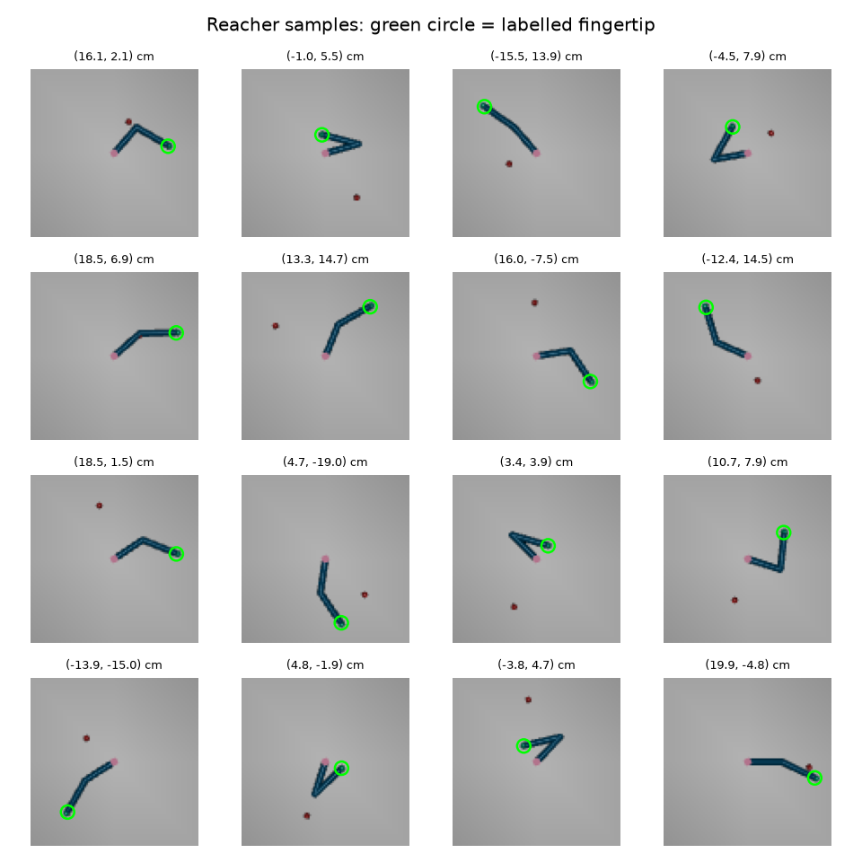

# Reacher fingertip: finding the arm's fingertip in an image

Given one top-down camera image of the MuJoCo Reacher arm, predict where its fingertip is: an (x, y) position in
centimetres. This is a small version of a common robot-vision problem, reading a precise position out of pixels, and it
compares four ways to do it, from a tiny CNN trained from scratch to an ImageNet-pretrained ResNet18.



*Random dataset frames. The green circle is the fingertip label, the title gives its position in cm. The red dot is
Reacher's target, a distractor here.*

---

## Contents
1. [Dataset: how it was made](#dataset-how-it-was-made)
2. [The 4 models](#the-4-models)
3. [Training](#training)
4. [Results](#results)
5. [What we learned](#what-we-learned)
6. [Commands](#commands)
7. [Files](#files)

---

## Dataset: how it was made

Code: [`physai/datasets/reacher.py`](../../physai/datasets/reacher.py) → `data/reacher_5000_s0.npz` (not in git;
recreate it with the command below).

1. **Random state.** Shoulder angle anywhere on the circle, elbow angle within its ±3 rad limit, and the red target at
   a random point within 20 cm of the base (rejection sampling inside a circle).
2. **Teleport, don't simulate.** The simulator is set straight to that state with zero velocity, so every frame is
   independent and the labels are exact.
3. **Render** a 96 × 96 RGB image from a fixed top-down camera that sees ±25 cm around the base
   (192 px per metre, so **1 pixel ≈ 0.52 cm**).
4. **Label** = the fingertip's true (x, y) in metres, read from MuJoCo. The target position and the joint angles are
   stored too, for analysing failures.

5,000 frames, seed 0, split at random 80 / 10 / 10:

| Split | Frames |
|---|---|
| train | 4,000 |
| val | 500 |
| test | 500 |

**In the PyTorch dataset** ([`physai/datasets/reacher_torch.py`](../../physai/datasets/reacher_torch.py)):
- Labels are divided by 0.21 m (the arm's reach), so x and y lie in [−1, 1].
- **Label-safe augmentation** on the train split only: colour jitter and Gaussian noise. Flips, crops or rotations
  are not used, because they would move the fingertip in the image without moving the label.

## The 4 models

Code: [`physai/models/cnn.py`](../../physai/models/cnn.py) and
[`physai/models/resnet.py`](../../physai/models/resnet.py).

| Model | Backbone | Pooling: from feature maps to numbers | Head | Parameters |
|---|---|---|---|---|
| **A** `cnn_gap` | small CNN from scratch: 5 conv blocks, 96 → 24 px, 64 channels | **global average pooling**: one number per channel (the average) | MLP 64 → 128 → 2 | 0.11 M |
| **B** `cnn_ssm` | the same small CNN | **spatial softmax**: one (x, y) keypoint per channel, where that channel fires | MLP 128 → 128 → 2 | 0.12 M |
| **C** `resnet18_probe` | ResNet18 pretrained on ImageNet, **frozen** | ResNet's global average pooling (512 features) | MLP 512 → 128 → 2 | 11.2 M (65 k trained) |
| **D** `resnet18_ft` | ResNet18 pretrained on ImageNet, **fine-tuned** | same as C | same as C | 11.2 M |

- **Spatial softmax** (Levine et al. 2016) turns each feature map into a probability map over pixels and returns its
  expected (x, y). The output is a list of image positions, which suits a task that is all about position. Global
  average pooling instead throws away *where* a feature fired.
- **D** trains only the head for the first 3 epochs, then unfreezes the backbone at 0.1× the head's learning rate.
  BatchNorm layers keep their ImageNet statistics, so training and evaluation normalise the same way.

## Training

Code: [`train.py`](train.py) with Hydra configs in [`configs/`](configs/).

| Setting | Value |
|---|---|
| Loss | MSE on normalised (x, y) (`loss=smooth_l1` is available as an ablation) |
| Optimiser | AdamW, lr 1e-3, weight decay 1e-4, cosine learning-rate schedule |
| Batch | 64 images |
| Epochs | 30 (C: 20 by default) |
| Checkpoints | `best.pt` (lowest val error) and `last.pt` in the run folder |
| Logging | Weights & Biases |

## Results

Mean fingertip error on the **validation split** (500 frames) at each model's best epoch, from the training logs.
Test-set numbers come from `evaluate.py` (see [Commands](#commands)); it has not been run yet.

| Model | Mean error | Median | 95th percentile | Best epoch |
|---|---|---|---|---|
| A CNN + global average pooling | 1.27 cm | 1.21 cm | 2.24 cm | 23 |
| **B CNN + spatial softmax** | **0.11 cm** | **0.10 cm** | **0.21 cm** | 22 |
| C ResNet18, frozen | 7.50 cm | 7.01 cm | 14.06 cm | 17 |
| D ResNet18, fine-tuned | 1.65 cm | 1.53 cm | 3.20 cm | 24 |

## What we learned

1. **The right inductive bias beats size.** B has 1 % of D's parameters and is 15× more accurate. Its error of 1.1 mm
   is about a fifth of a pixel: the spatial softmax averages over many pixels and so locates the fingertip more
   precisely than the pixel grid.
2. **Global pooling loses position.** A and B share the same CNN; only the pooling differs. Averaging over the image
   leaves the head to guess where things are from what is there, and costs 10× in error.
3. **ImageNet features don't transfer as-is.** The frozen ResNet18 (C) is the worst model: features trained to name
   objects in photos say little about the exact position of a thin arm in a synthetic image. Fine-tuning (D) recovers
   most of it, but still doesn't reach the small, purpose-built model.

## Commands

Run everything from the repo root. Set up the environment and log in to W&B first (see the
[main README](../../README.md#setup)); this training script always logs to W&B.

```bash
# 1. Dataset: 5,000 frames + a 4x4 sample grid
uv run python -m physai.datasets.reacher --n 5000 --seed 0 \
    --out data/reacher_5000_s0.npz --grid projects/reacher_fingertip/figures/reacher_grid.png

# 2. Train one model (runs go to outputs/<date>/<time>/)
uv run python projects/reacher_fingertip/train.py model=cnn_gap          # A
uv run python projects/reacher_fingertip/train.py model=cnn_ssm          # B
uv run python projects/reacher_fingertip/train.py model=resnet18_probe   # C
uv run python projects/reacher_fingertip/train.py model=resnet18_ft      # D

# ...or all four in one Hydra multirun (runs go to multirun/<date>/<time>/0..3/)
uv run python projects/reacher_fingertip/train.py -m model=cnn_gap,cnn_ssm,resnet18_probe,resnet18_ft

# Useful overrides
#   model.epochs=10   loss=smooth_l1   augment=false   seed=1   model.input_size=224 (ResNet: upsample)

# 3. Evaluate on the test split: results.md table + plots in figures/eval/
uv run python projects/reacher_fingertip/evaluate.py multirun/<date>/<time>/{0,1,2,3}/best.pt
```

`evaluate.py` writes, for every checkpoint: a predicted-vs-true scatter plot, random test frames and the 5 worst
predictions (true fingertip = green ring, prediction = red cross), keypoint plots for model B, and a table with mean /
median / 95th-percentile error, parameter count and latency per image. It also prints what the worst 5 % of frames
have in common (distance to the target, how folded the elbow is).

## Files

| Path | What it is |
|---|---|
| [`train.py`](train.py) | training script (Hydra + Accelerate + W&B) |
| [`evaluate.py`](evaluate.py) | test-set evaluation: table, plots, failure analysis |
| [`configs/train.yaml`](configs/train.yaml) | shared settings: data, batch size, loss, augmentation, W&B |
| [`configs/model/`](configs/model/) | one file per model: `cnn_gap`, `cnn_ssm`, `resnet18_probe`, `resnet18_ft` |
| [`figures/reacher_grid.png`](figures/reacher_grid.png) | dataset sample grid |
| [`physai/datasets/reacher.py`](../../physai/datasets/reacher.py) | camera, random states, rendering, splits |
| [`physai/datasets/reacher_torch.py`](../../physai/datasets/reacher_torch.py) | PyTorch dataset, label scaling, augmentation |
| [`physai/models/cnn.py`](../../physai/models/cnn.py) | small CNN, models A and B, spatial softmax |
| [`physai/models/resnet.py`](../../physai/models/resnet.py) | models C and D |
